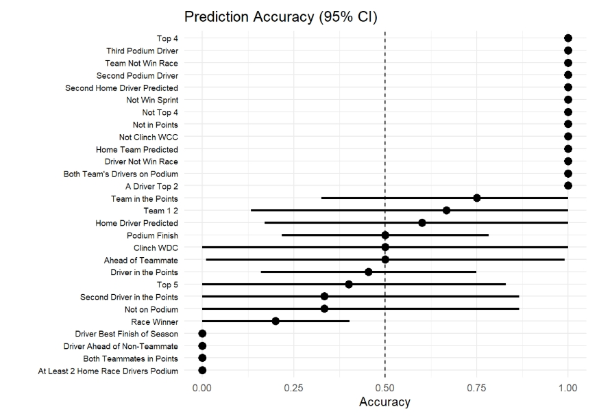

# 2025 Formula 1 Prediction Analysis

An independent data analysis project examining the accuracy of Formula 1 predictions across the 2025 season using R, statistical testing, and data visualization.

## Project Overview

This project analyzes Formula 1 predictions to determine which types of predictions were most accurate and what factors were associated with prediction success.

The analysis compares prediction types, drivers, and teams, and also tests whether predictions involving Lando Norris were less accurate than other race-winner predictions.

## Key Findings

- Prediction accuracy varied more by prediction type than by the specific driver being predicted.
- Team predictions had a higher observed accuracy than driver predictions, although the difference was not statistically significant.
- Prediction type showed a statistically significant relationship with accuracy, while the specific driver did not.
- There was no evidence that predicting Lando Norris reduced race-winner prediction accuracy.

## Methods

The project included:

- Data cleaning and reshaping in R
- Exploratory data analysis
- Confidence intervals for prediction accuracy
- Proportion tests
- Chi-square testing
- Logistic regression
- Fisher's Exact Test
- Permutation testing
- Data visualization with ggplot2

## Tools

- R
- tidyverse
- ggplot2
- R Markdown

## Repository Files

- [View the R Markdown source code](f1-prediction-analysis.Rmd)
- `bonafide_predictions.csv` — dataset used in the analysis
- [View the interactive HTML analysis](https://sawyerstein.github.io/f1-prediction-analysis-2025/f1-prediction-analysis.html)
- [View the PDF analysis](f1-prediction-analysis.pdf)
## Author

Sawyer Stein
